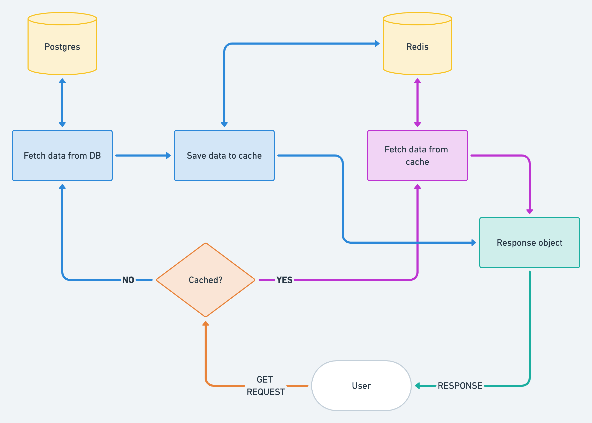
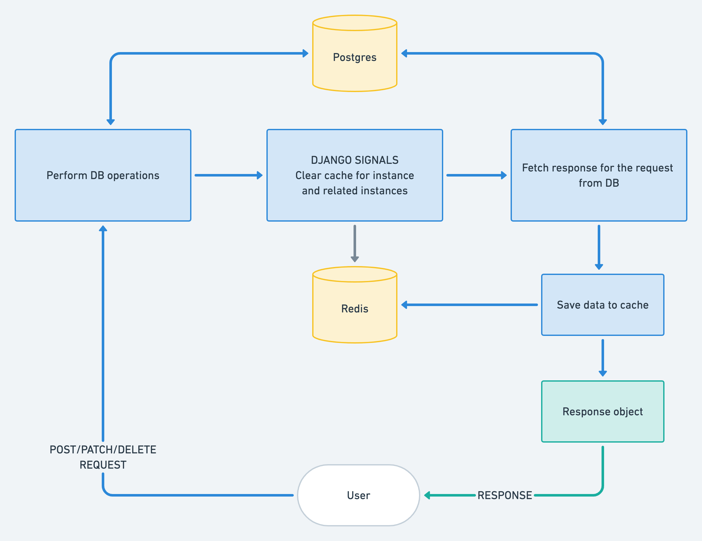

## Caching
Plio uses the Redis cache backend powered by the [Django Redis](https://github.com/jazzband/django-redis) package.

This guide aims to provide details on how Plio is using caching and pre-requisites for someone contributing to the code.

### Caching workflow
Plio's caching mechanism can be explained in three simple steps:
1. Receives an API request
2. Searches for the requested data in the cache
3. If not present, query the database and save the response in cache for future requests

##### Caching workflow explained via flow diagram

### Cache keys
The calculation of the cache keys are based on the model instances. For example, an instance for plio ID: 1 will have `plio_1` as the cache key.
For more details, check out the `get_cache_key` function in `plio/cache.py`.

### Cache invalidation
When a particular instance is updated, its cached value gets deleted along with the cache of any other related instances that depends on this cache. For example, consider a session instance cache that uses a plio instance cache. Now, if the plio is modified, the caches for both the plio instance and the session instance will be deleted.

The new cache will be set when the first fresh response is calculated from the database and will be used for subsequent requests.

##### Cache invalidation explained via flow diagram

### Current cached data
We only have implemented caching for data that has high GET requests. The following resources have been cached:
1. Plios
2. Users

For more details on the caching implementation for above, refer to the corresponding `serializers.py` files.
